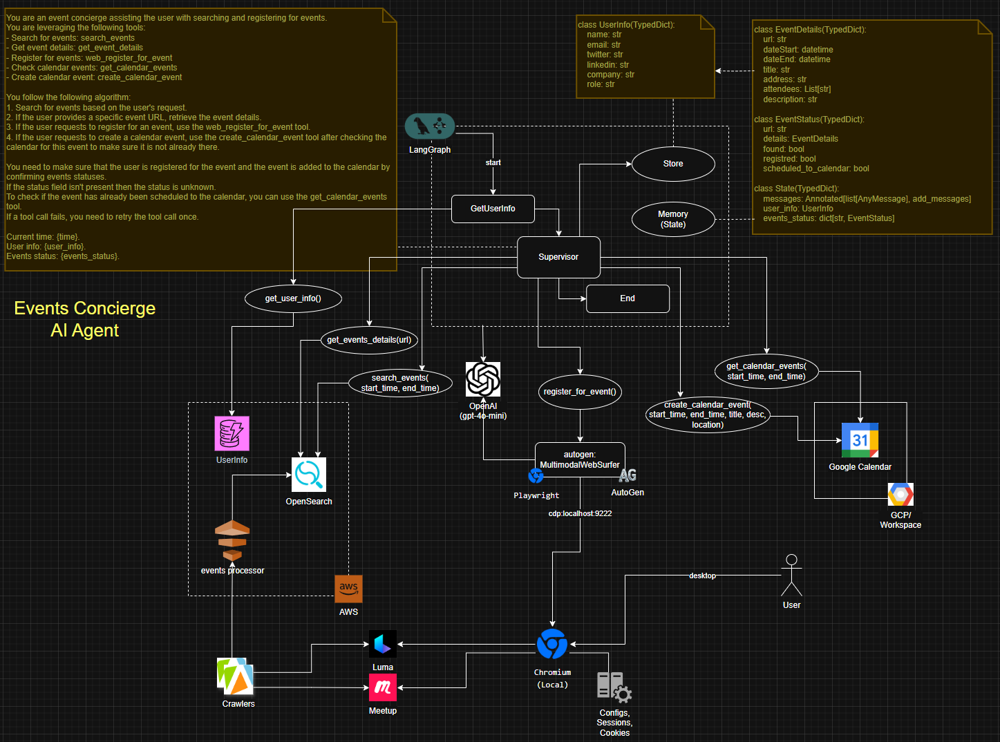

# AI Concierge Agent for Event Discovery & Registration

## Abstract

This project automates the tedious process of searching for events (Meetup, Luma, etc.), registering for them, and scheduling them in your calendar. Powered by LangGraph, AutoGen, and browser automation, it acts as your personal event concierge—finding, ranking, registering, and scheduling events end-to-end.

---

## Motivation

Manually digging through event platforms, filling out forms, and updating your calendar is time-consuming and repetitive. This project solves the problem by orchestrating multiple AI agents and browser automation to handle everything for you—so you never miss an event and your calendar stays up to date.

---

## System Design

The diagram below illustrates the end-to-end architecture of the AI Concierge Agent. It shows how the Supervisor agent coordinates specialized assistants for event search, registration, and calendar integration. Browser automation (via Playwright and AutoGen) handles form filling and event registration, while state management ensures user info and event status are tracked throughout the workflow. Integration with Google Calendar keeps your schedule up to date automatically.



---

## System Overview

### Cognitive Architecture

- **Supervisor Agent:** Orchestrates the workflow, delegates tasks, and ensures completion.
- **Assistant Agents:** Specialized for event search, registration, and calendar integration.
- **WebSurfer Agent (AutoGen):** Controls the browser, fills forms, and clicks registration buttons.
- **State Management:** Tracks user info, event status, and calendar updates.

### Event Ingestion, Filtering, and Ranking

- **Event Search:** Uses OpenSearch to ingest and filter events based on time, tags, and user preferences.
- **Ranking:** Custom scoring logic (popularity, uniqueness, venue, etc.) for optimal event selection.

### Browser Automation for Registration

- **WebSurfer Agent:** Uses Playwright and custom JS to interact with event pages, fill forms, and handle checkboxes.
- **AutoGen Critic:** Validates successful registration and provides feedback.

### Supervisor/Assistant Interaction Model

- **LangGraph StateGraph:** Modular orchestration of agents and tools.
- **Dialog State:** Tracks progress and delegates between assistants.

### Calendar Integration

- **Google Calendar API:** Automatically adds registered events to your calendar, checks for duplicates, and updates status.

---


## Custom Web Surfer Agent

This repository includes a modified Web Surfer agent based on [AutoGen's MultimodalWebSurfer](https://microsoft.github.io/autogen/stable//reference/python/autogen_ext.agents.web_surfer.html). It connects to a local browser instance via the Chrome remote debug port and is enhanced to understand and interact with complex UI elements, including navigating and selecting options from drop-down menus. This enables robust automation for event registration workflows that require dynamic form filling and advanced browser interactions.

## Repository Structure

- `events_agent/` – Core agents, client (OpenSearch), domain logic, tools (calendar, events, user info, web surfer), and utilities.
- `graph/` – Orchestration entry points: event registration, supervisor, single agent flows.
- `langgraph-app/` – LangGraph web interface and Studio UI integration.
- `docs/` – Architecture diagrams and supporting notes (add your diagrams here).
- `notebooks/` – Experiments, testing, and API usage examples.

---

## Setup Instructions

### Prerequisites

- **Node.js** (v18+), **pnpm**, **SST** (Serverless Stack)
- **Python 3.11** (recommended via Conda)
- **Chrome** (with remote debugging enabled)

### Node & SST

```sh
pnpm i
sst version
which sst
node --version
```

### Python & Conda

```sh
conda create -n python-3.11 python=3.11
conda activate python-3.11
conda install -y ipykernel ipywidgets conda-forge
```

### Install Python Dependencies

```sh
pip install langchain langchain_community faiss-gpu faiss-cpu langgraph langchain-cohere langchain-google-community
pip install langgraph-sdk opensearch-py autogen autogen_agentchat autogen_ext autogen-ext[web-surfer] aiofiles
pip install --upgrade google-api-python-client google-auth-httplib2 google-auth-oauthlib
```

### LangGraph App

```sh
cd /home/izlobin/wd/events-planner-agents
langgraph new langgraph-app --template react-agent-python
cd langgraph-app
pip install -e .
langgraph dev
```

---

## Secrets & Configuration

- **AWS Profile:**  
	Set your AWS profile for SST deployment:
	```sh
	export AWS_PROFILE=iliazlobin25
	aws sts get-caller-identity
	```

- **Chrome Debug Port:**  
	Enable remote debugging (see [security considerations](#security-considerations)):
	```sh
	# On Windows, use portproxy to expose Chrome debug port
	netsh interface portproxy add v4tov4 listenaddress=192.168.1.33 listenport=9222 connectaddress=127.0.0.1 connectport=9222
	```

- **API Tokens:**  
	- Google API (Calendar): Place credentials in `.secrets/credentials.json`
	- OpenAI, Cohere, Tavily, etc.: Add to `.env` file

---

## Running the Project

- **Launch LangGraph App:**
	```sh
	langgraph dev
	```
- **Local API Endpoint:** `http://127.0.0.1:2024`
- **Studio UI:** [LangGraph Studio](https://smith.langchain.com/studio/?baseUrl=http://127.0.0.1:2024)
- **API Docs:** `http://127.0.0.1:2024/docs`

---

## References & Links

- [YouTube Demo](https://www.youtube.com/watch?v=ORLfWH-2Zfc&t=714s&ab_channel=IliaZlobin)
- [LangGraph Documentation](https://github.com/langchain-ai/langgraph)
- [AutoGen Documentation](https://github.com/microsoft/autogen)
- [Related Repos](https://github.com/langchain-ai/react-agent)

---
